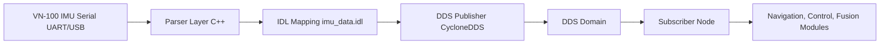

# System Architecture: DDS IMU Publishing Interface

This document describes the architecture of the **DDS IMU Publishing Interface**, implemented and validated for real-time inertial sensor data streaming using Cyclone DDS.  
It complements the paper:

> **M. J. Sosa Borrero, J. E. Serrano Castañeda, J. C. Martinez Santos, E. A. Puertas Del Castillo**.  
> *Implementation DDS-Based Publishing Interface for Real-Time Inertial Sensor Data in Navigation Systems*.  
> IEEE Caribbean Colombian Conference (C3 2025).

---

## 📑 Overview

The system bridges **low-level inertial measurement unit (IMU) data** with **high-level DDS distributed communication**.  
It enables raw IMU serial data streams to be published as **IDL-defined DDS Topics**, ensuring standards compliance, interoperability, and low latency.

---

## 🏗️ Architecture Diagram

---

## 🔧 Components

1. Inertial Sensor (VN-100 IMU)
- Outputs data via serial (USB–UART).
- Fields: yaw, pitch, roll, angular velocity, linear acceleration, magnetometer, timestamp.

2. Parser Layer (`imu_parser.cpp`)
- Reads raw serial or CSV-like frames.
- Converts strings/binary into structured values.
- Produces an instance of `imu::ImuData` (from IDL).

3. IDL Schema (idl/imu_data.idl)
- Defines the data model according to OMG IDL 4.2.
- Example fields:
    - @key uint32 sensor_id
    - uint64 timestamp
    - float yaw, pitch, roll
    - float gyro_x, gyro_y, gyro_z
    - float accel_x, accel_y, accel_z
    - float mag_x, mag_y, mag_z

4. DDS Publisher (`dds_publisher.cpp`)
- Registers the Topic defined in IDL.
- Configured with QoS policies (Reliable, KeepLast=10, Deadline=5 ms, LatencyBudget=1 ms).
- Publishes ImuData samples at ~200 Hz (VN-100 update rate).

5. DDS Domain
- Provides decoupled data distribution.
- Any subscriber in the same domain can consume ImuData.

6. Subscriber Nodes
- Validate data using DDS Spy or custom subscribers.
- Applications: navigation algorithms, sensor fusion modules, robotics/autonomous systems.

---

## ⚙️ QoS Configuration

QoS policies are stored in `qos/imu_qos.xml`.
Default profile (`imu_profile`) includes:
- Reliability: Reliable
- History: KeepLast = 10
- Deadline: 5 ms
- LatencyBudget: 1 ms
- Liveliness: Automatic, lease = 1 s
- ResourceLimits: 100 samples, 32 instances
- Alternate profile (`imu_constrained`) uses BestEffort for bandwidth-limited scenarios.

---

## 🧪 Validation

- Environment: Ubuntu 22.04, Cyclone DDS, VN-100 IMU via USB–UART.
- Monitoring: DDS Spy confirmed:
    - Correct IDL structure.
    - Messages at sensor’s native frequency.
    - Zero packet loss.
- Performance Metrics (Table II in paper):
    - Avg Latency: 4.2 ms
    - Jitter: 0.7 ms
    - Throughput: 200 msgs/s
    - CPU Usage: 12%
    - Memory: 48 MB